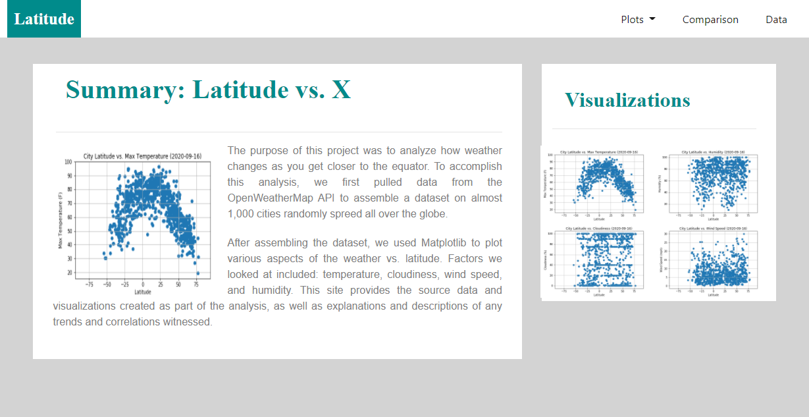
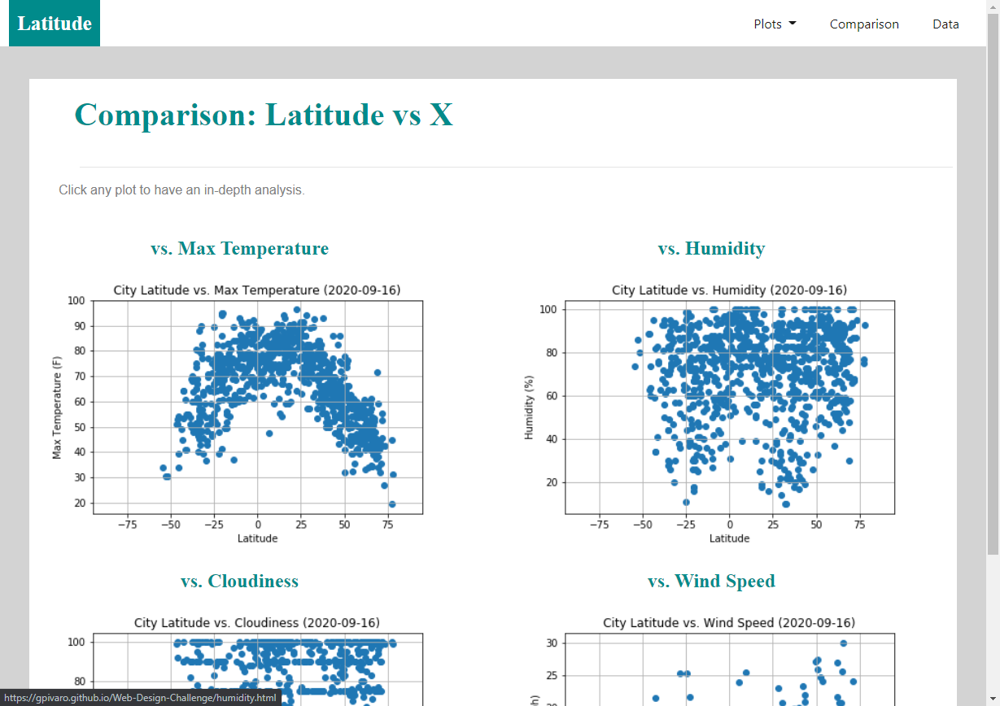
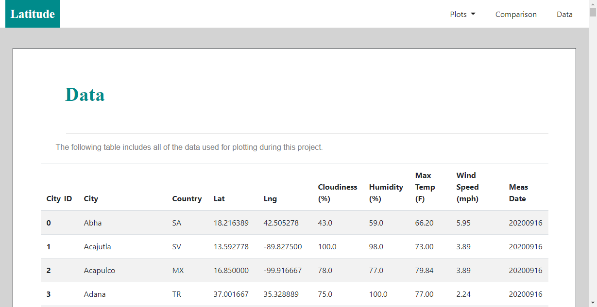

# Web Visualization Dashboard (Latitude)

## Rice University Data Analytics and Visualization Boot Camp 2020

This repository contains the website dashboard that is deployed to GitHub pages and can be accessed on this [link.](https://gpivaro.github.io/Web-Design-Challenge/)

## Latitude - Latitude Analysis Dashboard with Attitude

We will be creating a visualization dashboard website using visualizations we've previously [created.](https://github.com/gpivaro/6_Python_APIs_Homework) Specifically, we'll be plotting [weather data.](Resources/city_weather.csv)

In building this dashboard, we'll create individual pages for each plot and a means by which we can navigate between them. These pages will contain the [visualizations](max_temperature.html) and their corresponding explanations. We'll also have a [landing page](index.html), a page where we can see a [comparison](comparison.html) of all of the plots, and another page where we can view the [data](data.html) used to build them.

### Website Requirements

The website consists of 7 pages total, including:

* A [landing page](index.html) containing:
  * An explanation of the project.
  * Links to each visualizations page. There should be a sidebar containing preview images of each plot, and clicking an image should take the user to that visualization.
  
  
  
* Four visualization pages, each with:
  * A descriptive title and heading tag.
  * The plot/visualization itself for the selected comparison.
  * A paragraph describing the plot and its significance.
  
  
* A ["Comparisons" page](comparison.html) that:
  * Contains all of the visualizations on the same page so we can easily visually compare them.
  * Uses a Bootstrap grid for the visualizations.
    * The grid must be two visualizations across on screens medium and larger, and 1 across on extra-small and small screens.
    
    
    
* A ["Data" page](data.html) that:
  * Displays a responsive table containing the data used in the visualizations.
    * The table must be a bootstrap [table component.](https://getbootstrap.com/docs/4.3/content/tables/#responsive-tables)
    * The data must come from converting the `.csv` to HTML with Pandas [see notebook.](CSV_to_HTML.ipynb)
    
    

The website has a navigation menu that:

* Has the name of the site on the left of the nav which allows users to return to the [landing page](index.html) page from any page.
* Contains a dropdown menu on the right of the navbar named "Plots" that provides a link to each individual [visualization](max_temperature.html) page.
* Provides two more text links on the right: "Comparisons," which links to the [comparisons](comparison.html) page, and "Data," which links to the [data page](data.html).
* Is responsive using media queries (notice the background color change).
